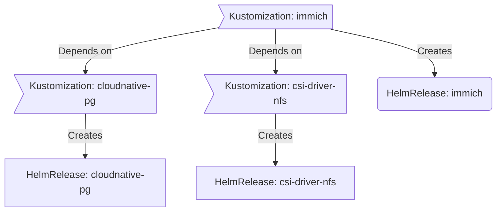

<div align="center">


###  F9's Homelab 

_... managed with Flux, Renovate, Doco-CD and GitHub Actions_ 

</div>

<div align="center">

[](https://talos.dev)&nbsp;&nbsp;
[](https://kubernetes.io)&nbsp;&nbsp;
[](https://fluxcd.io)&nbsp;&nbsp;
[](https://github.com/fma965/f9-homelab/actions/workflows/renovate.yaml)&nbsp;&nbsp;
[](https://deepwiki.com/fma965/f9-homelab)

</div>

---

##  Overview

This is a mono repository for my home infrastructure: a Talos Kubernetes cluster and a separate Docker host. I try to adhere to Infrastructure as Code (IaC) and GitOps practices using tools like [Talos](https://www.talos.dev), [Kubernetes](https://kubernetes.io/), [Flux](https://github.com/fluxcd/flux2), [Doco-CD](https://github.com/kimdre/doco-cd), [Renovate](https://github.com/renovatebot/renovate), and [GitHub Actions](https://github.com/features/actions). The layout follows [onedr0p/home-ops](https://github.com/onedr0p/home-ops), and all secrets are stored in 1Password and never committed to Git.

---

##  Kubernetes

My Kubernetes cluster is deployed with [Talos](https://www.talos.dev) on three control-plane nodes that also run workloads. This is a semi-hyper-converged cluster: workloads and block storage share the same resources on my nodes, while a separate [TrueNAS](https://truenas.com) server provides NFS/SMB shares, bulk file storage and backups.

### Core Components

- **Networking**: [cilium](https://github.com/cilium/cilium) provides eBPF-based networking and announces LoadBalancer IPs to my UniFi gateway over BGP, [multus](https://github.com/k8snetworkplumbingwg/multus-cni) attaches pods to extra VLANs, [envoy-gateway](https://github.com/envoyproxy/gateway) handles ingress, [cloudflared](https://github.com/cloudflare/cloudflared) publishes services through Cloudflare Tunnel, and [external-dns](https://github.com/kubernetes-sigs/external-dns) keeps DNS records in sync.
- **Security & Secrets**: [cert-manager](https://github.com/cert-manager/cert-manager) issues TLS certificates, [external-secrets](https://github.com/external-secrets/external-secrets) with [1Password Connect](https://github.com/1Password/connect) injects secrets, and [authelia](https://github.com/authelia/authelia) with [lldap](https://github.com/lldap/lldap) provides single sign-on.
- **Storage & Data Protection**: [rook](https://github.com/rook/rook) provides distributed Ceph storage, [openebs](https://github.com/openebs/openebs) provides local hostpath volumes, [csi-driver-nfs](https://github.com/kubernetes-csi/csi-driver-nfs) mounts NAS shares, and [kopiur](https://github.com/home-operations/kopiur) handles PVC backups and restores. [cloudnative-pg](https://github.com/cloudnative-pg/cloudnative-pg) and [dragonfly](https://github.com/dragonflydb/dragonfly-operator) provide PostgreSQL and Redis-compatible databases.
- **Observability**: [kube-prometheus-stack](https://github.com/prometheus-community/helm-charts), [grafana-operator](https://github.com/grafana/grafana-operator), [victoria-logs](https://github.com/VictoriaMetrics/VictoriaLogs) and [gatus](https://github.com/TwiN/gatus) cover metrics, dashboards, logs and status checks.
- **Cluster Operations**: [tuppr](https://github.com/home-operations/tuppr) automates Talos and Kubernetes upgrades, [spegel](https://github.com/spegel-org/spegel) runs a cluster-local OCI image mirror, [descheduler](https://github.com/kubernetes-sigs/descheduler) and [reloader](https://github.com/stakater/Reloader) keep workloads balanced and fresh, and [actions-runner-controller](https://github.com/actions/actions-runner-controller) runs self-hosted GitHub Actions runners.

### GitOps

[Flux](https://github.com/fluxcd/flux2) watches the [kubernetes](./kubernetes/) folder and makes changes to my cluster based on the state of this Git repository.

Flux recursively searches the `kubernetes/apps` folder until it finds the top-level `kustomization.yaml` in each directory and applies all the resources listed in it. That `kustomization.yaml` generally only contains a namespace resource and one or more Flux kustomizations (`ks.yaml`). Under the control of those Flux kustomizations there will be a `HelmRelease` or other resources related to the application.

[Renovate](https://github.com/renovatebot/renovate) watches my **entire** repository looking for dependency updates, and when it finds one it opens a pull request. When PRs are merged, Flux applies the changes to my cluster.

### Directories

```sh
📁 kubernetes
├── 📁 apps       # applications, grouped by namespace
├── 📁 components # re-usable kustomize components (backups, alerts, GPU, ...)
└── 📁 flux       # flux system configuration
```

### Flux Workflow

This is a high-level look at how Flux deploys my applications with dependencies. In most cases a `Kustomization` depends on other `Kustomization`s. The example below shows that `immich` will not be deployed or upgraded until `cloudnative-pg` and `csi-driver-nfs` are installed and healthy.



---

##  Repository Structure

```sh
📁 .
├── 📁 bootstrap  # takes fresh Talos nodes to a cluster Flux manages (helmfile + kustomize)
├── 📁 docker     # compose stacks for my Docker host, deployed by Doco-CD
├── 📁 kubernetes # everything Flux manages
├── 📁 talos      # Talos machine configuration (templates and schematic)
├── 📁 .github    # workflows, labels and issue templates
└── 📁 .mise      # pinned tool versions (mise)
```

Everyday tasks are wrapped in [just](https://github.com/casey/just) recipes, and tool versions are pinned with [mise](https://mise.jdx.dev). Run `just` to list the recipes.

### Talos

Machine configuration lives in [talos](./talos/) as composable multi-document templates: `cluster.yaml.j2` applies to every node, `controlplane.yaml.j2` to control-plane nodes, and `nodes/<role>/<node>.yaml.j2` holds per-node settings. Secrets are `op://` references resolved with `op inject` at render time. See the [Talos README](./talos/README.md) for details.

```sh
just talos render-config <node>   # render a node's machine config
just talos apply-node <node>      # render and apply it
just talos upgrade-node <node>    # upgrade Talos on a node
```

### Bootstrap

[bootstrap](./bootstrap/) takes freshly installed Talos nodes to a cluster that Flux manages on its own. It applies the Talos config, bootstraps Kubernetes, installs the base CRDs and secrets, and syncs a helmfile of core apps (cilium, coredns, spegel, cert-manager, external-secrets, 1Password Connect, Flux). Flux then takes over.

Prerequisites: run `mise install`, sign in to the 1Password CLI (`op`), and have a valid `talosconfig` at the repo root.

```sh
just bootstrap cluster
```

> [!NOTE]
> The Cilium BGP peering with my UniFi gateway is documented in [kubernetes/apps/kube-system/cilium](./kubernetes/apps/kube-system/cilium/README.md).

---

##  Docker

A few workloads that need dedicated hardware, or that I want running independently of the cluster, run as Docker Compose stacks on my TrueNAS server. These are AI workloads (llama.cpp, Whisper, Immich machine learning), Frigate NVR, a Garage S3 backup target, Proxmox Backup Server, CUPS, a Brother scanner Scan-button service that feeds Paperless, and a few exporters.

[Doco-CD](https://github.com/kimdre/doco-cd) watches the [docker](./docker/) folder and deploys the stacks listed in [.doco-cd.yaml](./.doco-cd.yaml) based on the state of this repository.

---

##  Cloud Dependencies

Most of my infrastructure and workloads are self-hosted, but I rely on the cloud for a few key parts of my setup. Note that some of these are not part of this repo but are things I use alongside it.

| Service                                   | Use                                                            | Cost    |
| ----------------------------------------- | -------------------------------------------------------------- | ------- |
| [1Password](https://1password.com/)       | Secrets with [External Secrets](https://external-secrets.io/)  | ~$40/yr |
| [Cloudflare](https://www.cloudflare.com/) | Domain, DNS and Tunnel                                         | ~£6/yr  |
| [GCP](https://cloud.google.com/)          | Voice interactions with Home Assistant over Google Assistant   | Free    |
| [GitHub](https://github.com/)             | Hosting this repository and continuous integration/deployments | Free    |
| [Discord](https://discord.com/)           | Alerts and notifications                                       | Free    |
| [Pushover](https://pushover.net/)         | Kubernetes alerts and application notifications                | $5 OTP  |

---

##  DNS

Two instances of [ExternalDNS](https://github.com/kubernetes-sigs/external-dns) run in the cluster. One syncs private DNS records to my UniFi gateway using the [ExternalDNS webhook provider for UniFi](https://github.com/kashalls/external-dns-unifi-webhook), and the other syncs public DNS records to Cloudflare. Records are created from routes attached to one of two gateways: `envoy-internal` for private DNS and `envoy-external` for public DNS.

---

##  Hardware

### Compute

**Dell OptiPlex 3060 × 3** · Intel Core i5-8500T (6 cores) · 64 GB RAM · 2.5 GbE · Talos / Kubernetes

- **OS** — 480 GB Intel SATA SSD
- **Rook-Ceph** — 256 GB Toshiba NVMe

### Storage

**TrueNAS** server for NFS/SMB shares, bulk file storage, backups and the Docker stacks above.

### Networking

- **UniFi Cloud Gateway Fibre** — router and BGP peer for Cilium

---

##  Gratitude and Thanks

Thanks to the [Home Operations](https://discord.gg/home-operations) Discord community and to [onedr0p/home-ops](https://github.com/onedr0p/home-ops), which this repository's structure follows. Be sure to check out [kubesearch.dev](https://kubesearch.dev/) for ideas on how to deploy applications.
